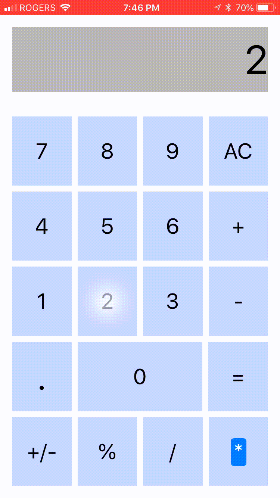
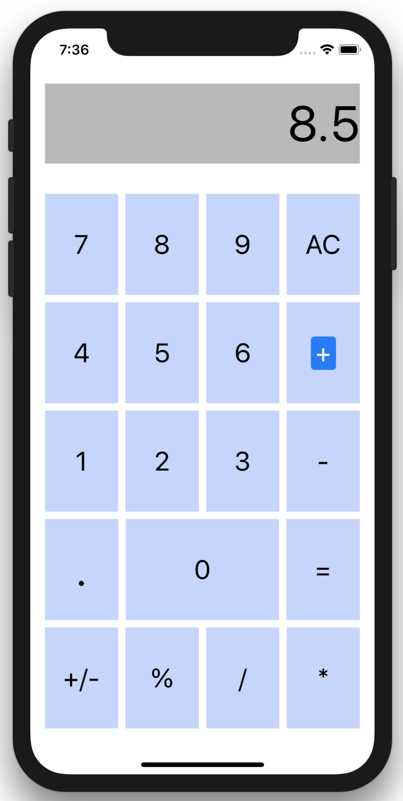
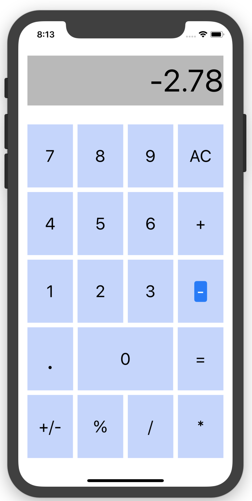

# Calculator

Simple, no frills, ios calculator. With cutting-edge features

# All new dynamic addition engine
- Improve your arithmetic game by adding different numbers together

# Now Introducing negative numbers
- seamlessly subtract numbers to create *smaller* numbers

First ios App, happy with the results and gave me a good foothold in the swift / XCode environment. I will use the tools I learned during this project to create cooler, more useful apps in the future.

//
//  Created by John David Anthony on 2018-06-04.
//  Copyright © 2018 John David Anthony. All rights reserved.
//
